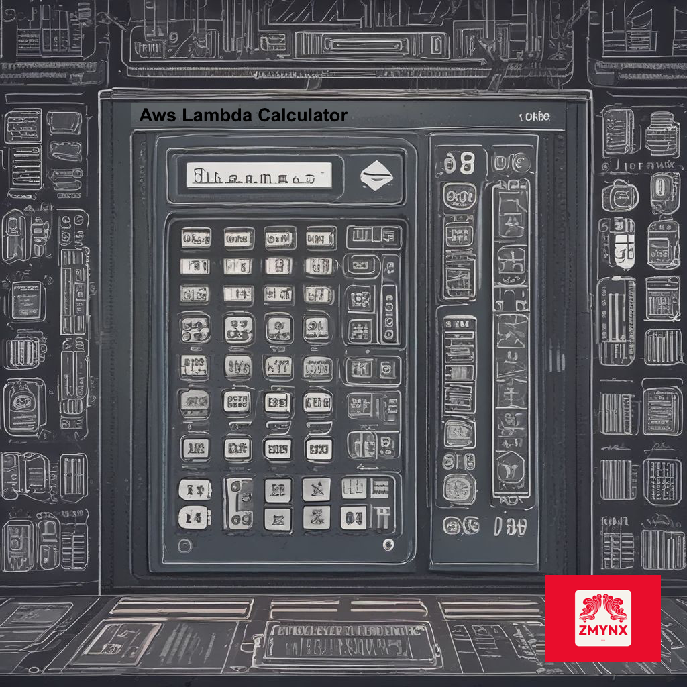

# AWS Lambda Calculator

### A comprehensive calculator for AWS Lambda pricing and performance analysis

---

## 📚 Table of Contents

- [Documentation](#-documentation)
- [Quick Start](#-quick-start)
- [License](#-license)
- [Contributing](#-contributing)
- [Support](#-support)

---

## 📖 Documentation

Extensive documentation is available via our **[GitHub Pages Docs site](https://zmynx.github.io/aws-lambda-calculator/)**.

---

## 🚀 Quick Start

> [!TIP]
> Check it out locally or remotely using DevPod
>
> 

---

## 📜 License

This project is licensed under the **Apache License**.

**Disclaimer:** Provided AS IS, no warranty given, no liability taken - USE AT YOUR OWN RISK.

For more information, see our [LICENSE](./LICENSE) file.

---

## 🤝 Contributing

Shout out to our amazing contributors! Want to contribute?

Follow our [CONTRIBUTING](./docs/CONTRIBUTING) guide in the docs section.

---

## 💖 Support

Enjoy our projects? Make sure to follow for more!

Want to keep enjoying great projects like this? Contribute to open source!

---

[:arrow_up: Back to top](#aws-lambda-calculator)

